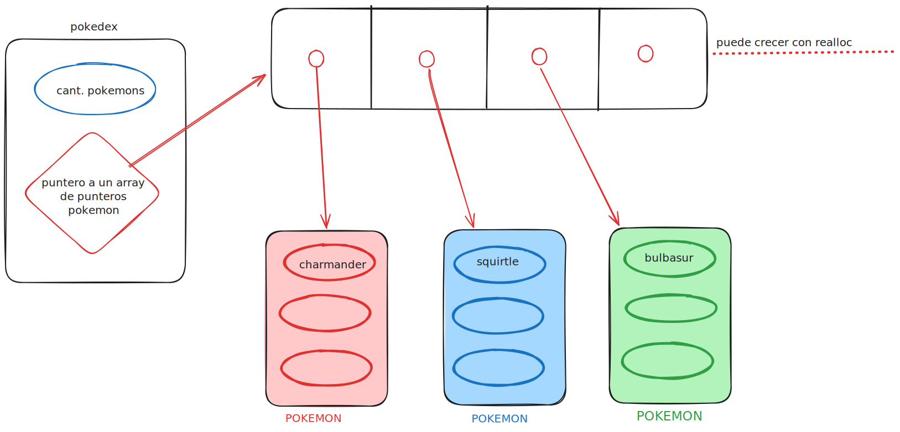
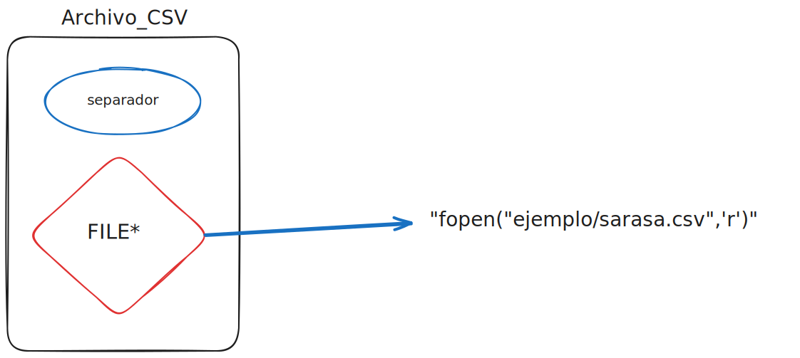

<div align="right">

</div>

# TP1


## Alumno: Nicolas Martin Guerrero - 112514 - nguerero@fi.uba.ar

- Para compilar:

```bash
gcc tp1.c src/*.c
```

- Para ejecutar:

```bash
./a.out
```

- Para ejecutar con valgrind:
```bash
valgrind ./a.out
```

---

### csv.c
Las funciones reciben un struct que contiene un puntero al archivo y un separador, `abrir_archivo_csv` usa malloc para crear el struct y abre el archivo con el nombre que recibio como argumento, ambos van a ser liberados/cerrados en `cerrar_archivo_csv`.

Lo mas importante de este .c es la funcion `leer_linea_csv` que lee una linea de 300 caracteres y la guarda en un char*, este char* lo uso en strchr para encontrar la ubicacion del delimitador y poder dividir la linea en palabras separadas.

si al char* que guarda la linea leida le resto la ubicacion del delimitador el resultado es la longitud de la palabra que hay que parsear. Este metodo lo vimos en clase para imitar el funcionamiento de strtok

### Pokedex.c

Primero creo el struct pokedex con un malloc y tambien uso malloc para crear un array de punteros a struct pokemon.
<div align="center">

</div>

Cuando quiero agregar un pokemon, si es el primero ya tiene espacio en el array, pero los sigiuentes requieren que haga un realloc para el array, un malloc para el struct pokemon y un malloc para el nombre,
```c
pokedex->cantidad_pokemons++;
struct pokemon** new_ptrarray=(struct pokemon**)
realloc(pokedex->ptr_pokemons,(pokedex->cantidad_pokemons)*
(sizeof(struct pokemon*)));
		
if(new_ptrarray==NULL){
		printf("error al reasignar memoria a Pokedex->ptr_pokemons");
		return false;
	}
pokedex->ptr_pokemons=new_ptrarray;
struct pokemon* nuevo_poke=malloc(sizeof(struct pokemon));
if(nuevo_poke==NULL){
		printf("error al asignar memoria");
		return false;
	}
		
nuevo_poke->nombre=(char*)malloc(strlen(pokemon.nombre)+1);
if(nuevo_poke->nombre==NULL){
	printf("error al asignar memoria");
	return false;
    }
```
Tengo que usar malloc para cada nombre de los pokemons porque sino todos los pokemons comparten una misma ubicacion de memoria(char*) y todos los pokuemons se llaman como el ultimo, tampoco puedo simplemente guardar la ubicacion del pokemon que me pasaron como argumento, porque ese struct del argumento es una copia. Por ende hay que poner los valores del pokemon pasado por argumento uno a uno.

`pokedex_buscar_pokemon` usa un loop que recorre la pokedex y un strcmp para encontrar el pokemon buscado.

`pokedex_iterar_pokemons` y `pokedex_destrur` tambien usan el mismo loop, para usar la funcion pasada como agumento y para liberar los pokemons.

por ultimo use selection sort para ordenar los nombres alfabeticamente, con strcmp que compara 2 strings basado en el valor ascii de cada caracter


---

## Respuestas a las preguntas teóricas
 - Explicar con diagramas cómo quedan dispuestas las estructuras y elementos en memoria.
 <div align="center">

</div>
la estructura Archivo guarda un char "separador" que funciona de delimitador y un FILE* que  es donde esta abierto el archivo csv.
<div align="center">

</div>
ya lo explique previamente. La estructura pokedex tiene la cantidad de pokemons que existen en la pokedex y un puntero a un array de punteros de tipo struct pokemon, de esta forma puedo usar realloc en el array y para cada struct pokemon. se accede a la info de los pokemon de la siguiente forma:

```c
    pokedex->ptr_pokemon[i]->nombre
```

el indice sirve para desrefernciar al pknm.
 - Explicar la complejidad computacional de **cada una** de las funciones que se piden implementar.

`abrir_archivo_csv` O(1) es una inicializacion de un elemento.

`leer_linea_csv` O(n^f) donde n es la cantidad de columnas de cada linea y f es la funcion pasada por argumento, en caso de considerar el loop que deberia encapsular esta funcion, entonces la complejidad deberia ser O(n^m^f) ya que es linea por columna por funcion.  

`cerrar_archivo_csv` O(1) es liberar/cerrar un elemnto

`pokedex_crear` O(1) es una inicializacion de un elemento.

`pokemon_agregar_pokemon` O(1) solamente es asignar valores a un elemento. si condiramos que es una funcion pensada para ser repetida n veces para aniadir(no tengo enie T-T) pokemons, puede ser O(n).

`pokedex_buscar_pokemon` O(n) se necesita recorrer toda la pokedex en el peor de los casos.

`pokedex_cantidad_pokemon` O(1) siempre.

`pokedex_destrur` O(n) se necesita recorrer toda la pokedex en el peor de los casos.

`pokedex_iterar_pokemons` O(n^m) se necesita recorrer toda la pokedex y en cada caso se aplica la funcion, que al ser un puntero puede ser cualquier de cualquier complejidad.
